#  项目部署与安装指南
## 1. 环境准备

### 服务器推荐配置
为了保证系统流畅运行，建议服务器配置不低于：
*   **CPU**：2 核
*   **内存**：2 GB 及以上
*   **操作系统**：CentOS 7+ / Ubuntu 20.04+ / Debian 11+

### 软件环境要求
| 组件 | 版本要求 | 说明 |
| :--- | :--- | :--- |
| **PHP** | `>= 8.0.2` | 需开启 `fileinfo`, `openssl`, `mysqli` 等扩展 |
| **MySQL** | `>= 5.7` | 建议使用 MySQL 5.7 或 MariaDB 10.3+ |
| **Node.js** | `>= 16.0` | 用于运行 WebSocket 信令服务 |
| **Nginx/Apache** | 最新版 | 推荐使用 Nginx 以获得更好的并发性能 |

> ** 推荐工具**：强烈建议使用 **宝塔面板 (BT Panel)** 进行服务器管理，可简化环境安装和站点配置过程

---

## 2. 源码部署与后端启动

### 第一步：上传与解压
1.  下载项目源码包（`.zip` 或 `.rar`）。
2.  将源码上传至服务器网站根目录（如 `/www/wwwroot/your_domain`）。
3.  解压文件，确保 `index.php` 等文件位于根目录下，而不是子文件夹中。

### 第二步：安装 Node.js 依赖
WebSocket 服务依赖 Node.js 环境。请在项目根目录下打开终端（或通过宝塔的终端功能），执行以下命令：

1.  **初始化环境**（如果尚未安装 Node.js，请在宝塔软件商店安装）：
    ```bash
    # 检查 Node 版本
    node -v
    npm -v
    ```

2.  **安装依赖库**：
    根据 `package.json` 配置，执行安装命令：
    ```bash
    cd /www/wwwroot/your_domain # 进入项目目录
    npm install
    ```
    *涉及依赖：`ws`, `express`, `axios`, `dotenv` 等。*

### 第三步：配置反向代理 (WebSocket)
为了让前端能通过域名连接 WebSocket 服务，需在 Nginx 中配置反向代理。

**Nginx 配置示例：**
在您的站点配置文件 `server` 块中添加以下 location（若设置WebSocket 服务运行在 `8080` 端口）：

```nginx
# WebSocket 反向代理配置
location /ws/ {
    proxy_pass http://127.0.0.1:8080/;
    proxy_http_version 1.1;
    proxy_set_header Upgrade $http_upgrade;
    proxy_set_header Connection "Upgrade";
    proxy_set_header Host $host;
    proxy_set_header X-Real-IP $remote_addr;
    proxy_set_header X-Forwarded-For $proxy_add_x_forwarded_for;
}
```

### 第四步：启动 WebSocket 服务
建议使用 **PM2** 进程管理工具来守护 Node.js 进程，防止服务意外退出。

1.  **安装 PM2**：
    ```bash
    npm install pm2 -g
    ```

2.  **启动服务**：
    ```bash
    # 在项目根目录执行
    pm2 start server.js --name "Chat-WS-Server"
    ```

3.  **设置开机自启**：
    ```bash
    pm2 startup
    pm2 save
    ```

---

## 3. Web 安装与后台配置

### 第五步：Web 安装向导
1.  在浏览器访问您的域名，并加上 `/install/` 路径：
    `http://your_domain/install/`
2.  根据页面提示，填写数据库连接信息（数据库名、用户名、密码）。
3.  点击“安装”，等待系统自动初始化数据表。

### 第六步：后台配置
1.  安装完成后，系统会自动跳转至后台登录页。
    *   **默认账号**：`admin`
    *   **默认密码**：`admin123`
2.  登录后，找到 **“站点配置”** -> **“WebSocket 配置”**。
3.  修改 **“WebSocket 连接地址”**：
    *   如果您配置了 Nginx 反向代理，请填写：`ws://your_domain/ws/` (如果是 HTTPS 网站，请使用 `wss://`)。
    *   确保此地址与前端连接地址一致，否则无法收发消息。

---

## 4. 安全与伪静态设置

为了保障项目安全运行，请配置以下规则。

### 禁止访问敏感文件
防止 `.env` 等配置文件泄露。

**Apache (.htaccess):**
```apache
ErrorDocument 404 /404.html
ErrorDocument 403 /403.html
<FilesMatch "\.(env|git|log)$">
    Require all denied
</FilesMatch>
```

**Nginx:**
```nginx
error_page 404 /404.html;
error_page 403 /403.html;

location ~* \.(env|git|log)$ {
    return 403;
}
```

---

###  避坑指南

#### 1. 服务器与安全组
*   **安全组端口放行**：在云服务商（如阿里云、腾讯云）的控制台，除了放行 `80` (HTTP) 和 `443` (HTTPS) 端口，**务必检查并放行** `22` (SSH) 端口。如果你的 WebSocket 服务（Node.js）是直接通过 IP:端口访问的，还需要放行对应的端口（如 `8080`）。
*   **内存不足风险**：项目包含 PHP 和 Node.js 两个后端服务，2G 内存是最低要求。在编译安装软件或运行大型任务时，可能会因内存不足导致进程被系统强制终止。建议配置 Swap 虚拟内存或升级服务器配置。

#### 2. 软件环境配置
*   **PHP 扩展缺失**：安装好 PHP 后，很多扩展默认是关闭的。请在宝塔面板的 PHP 管理界面，**手动开启** `fileinfo`、`openssl`、`mysqli` 等扩展。特别是 `fileinfo`，如果未开启，会导致文件上传功能报错。
*   **PHP 禁用函数**：检查 PHP 的“禁用函数”列表，确保 `proc_open`、`putenv` 等函数没有被禁用，否则可能导致部分功能异常。
*   **Node.js 版本不兼容**：不要盲目追求最新版 Node.js。请严格按照文档要求安装 `>= 16.0` 的版本（推荐 16.x 或 18.x），版本过高或过低都可能导致 `npm install` 安装依赖失败。
*   **Nginx vs Apache**：强烈推荐使用 **Nginx**。Apache 对 WebSocket 的支持不如 Nginx 稳定和高效，在高并发场景下容易出现问题。

#### 3. 源码与权限管理
*   **文件路径错误**：解压源码后，请确保 `index.php`、`server.js` 等核心文件直接位于网站根目录下，而不是在根目录的子文件夹里。
*   **目录权限问题**：部署后如果出现 500 错误或无法上传文件，90% 是权限问题。务必通过终端执行命令，将网站目录的所有者设置为 `www`，并为 `runtime`、`storage`、`public/uploads` 等需要写入的目录赋予 `755` 或 `777` 权限。
    ```bash
    chown -R www:www /www/wwwroot/your_domain
    chmod -R 755 /www/wwwroot/your_domain
    ```

#### 4. WebSocket 服务与反向代理
*   **依赖安装失败**：执行 `npm install` 时，如果速度极慢或报错，通常是网络问题。请先执行 `npm config set registry https://registry.npmmirror.com` 切换到国内镜像源，然后再尝试安装。
*   **服务未守护**：不要直接用 `node server.js` 启动服务，这样关闭终端后服务就会停止。必须使用 `pm2` 等进程管理工具来启动和守护 Node.js 进程，并设置开机自启。
*   **Nginx 配置遗漏**：在 Nginx 中配置 WebSocket 反向代理时，以下三行配置是**核心**，缺一不可，否则无法建立连接：
    ```nginx
    proxy_http_version 1.1;
    proxy_set_header Upgrade $http_upgrade;
    proxy_set_header Connection "Upgrade";
    ```

#### 5. HTTPS 与 WSS 协议匹配
这是最容易混淆和出错的地方，请严格对照：

*   **情况 A：网站是 HTTP**
    *   前端 JS 连接地址：`ws://your_domain/ws/`
    *   Nginx 配置：正常配置反向代理到 `http://127.0.0.1:8080`
*   **情况 B：网站是 HTTPS (已安装 SSL 证书)**
    *   **翻车点**：前端 JS 连接地址**必须**是 `wss://your_domain/ws/`。如果仍然使用 `ws://`，浏览器会因“混合内容”安全策略而阻止连接。
    *   **Nginx 配置**：Nginx 负责处理外部的 HTTPS/WSS 请求，然后内部转发给 Node.js。因此，Nginx 配置中的 `proxy_pass` **仍然是** `http://127.0.0.1:8080`。Node.js 服务本身不需要配置 SSL。

#### 6. 安装与后台配置
*   **数据库连接失败**：在安装向导页面，如果提示无法连接数据库，请检查：
    1.  数据库用户名、密码、数据库名是否填写正确。
    2.  数据库服务是否已启动。
*   **后台地址不一致**：安装完成后，登录后台修改“WebSocket 连接地址”时，必须与前端实际使用的地址（`ws://` 或 `wss://`）完全一致，并且路径（如 `/ws/`）要与 Nginx 配置中的 `location` 匹配。
---

###  核心功能

####  即时通讯
*   **基础聊天**：支持一对一私聊与群组聊天，提供流畅的文本消息收发体验。
*   **多媒体消息**：支持发送图片、文件、音乐、视频等多种格式内容，丰富沟通形式。
*   **语音/视频通话**：内置一对一实时音视频通话功能，让沟通更近一步。
*   **消息管理**：支持消息撤回、引用回复、批量删除、聊天记录搜索及导出为证据包。
*   **状态反馈**：提供“正在输入...”状态提示与消息已读/未读回执功能。

####  社交互动
*   **好友与群组**：完善的好友管理（添加、备注、分组、删除）与群组功能（创建、邀请、公告、管理）。
*   **红包系统**：支持在群聊中发送拼手气红包和平均红包，增加互动趣味性。
*   **礼物与亲密度**：可向好友赠送虚拟礼物，提升双方亲密度，并解锁专属关系标识。
*   **朋友圈**：内置社交圈功能，用户可以分享动态，与好友互动。

####  娱乐与活动
*   **活动中心**：集成签到、CDK兑换、信用借款等运营活动，提升用户活跃度。
*   **内置游戏**：提供猜数字、掷骰子、21点等多款轻量级休闲游戏，支持G币下注娱乐。
*   **G币系统**：平台内嵌虚拟货币“G币”，可用于游戏、红包、借款等多种场景。

####  实用工具
*   **文件管理**：支持个人文件与群文件上传、下载、分享与管理，采用分片上传技术保障大文件传输稳定性。
*   **视频解析**：支持解析抖音、B站等平台的视频链接，可直接在应用内预览并分享视频卡片。
*   **音乐分享**：集成网易云音乐搜索与试听功能，可将歌曲卡片分享给好友，支持30秒片段试听。
*   **邮件系统**：内置应用内邮件功能，支持收发、标记已读、删除等操作，方便接收系统通知。

####  个性化定制
*   **多主题皮肤**：提供现代简约、深邃暗夜、赛博朋克、樱花和风、海洋之心等多种主题，一键切换整体视觉风格。
*   **动态背景**：支持粒子星空、海浪波纹、毛玻璃等多种动态聊天背景，打造沉浸式视觉体验。
*   **气泡与字体**：可自定义聊天气泡形状（如iMessage风格、漫画风格）及字体方案，调整字号大小。
*   **字体颜色**：提供多种字体颜色方案，包括纯黑、暖棕、柔和灰等，满足不同阅读偏好。

####  隐私与安全
*   **消息上锁**：为私密对话提供额外保护，支持多种防护模式：
    *   **密码防护**：接收方需回答预设问题才能查看消息。
    *   **时间防护**：消息仅在指定时间内可读，过期自动失效。
    *   **阅后即焚**：消息被查看后，在设定时间内自动销毁。
*   **数据防篡改**：采用哈希链（Hash Chain）技术，确保聊天记录在本地存储的完整性与不可篡改性。
*   **账号安全**：支持账号注销、异地登录检测与强制下线。

####  其他特性
*   **多端同步**：支持离线消息同步，确保消息不丢失。
*   **消息翻译**：内置多语言翻译功能，打破沟通障碍。
*   **桌面通知**：支持浏览器桌面通知与新消息提示音。
*   **截图工具**：集成快捷截图功能，方便信息分享。

---

###  特色社交空间：小世界

*   **亲密度养成系统**
    *   **情感量化**：系统会根据互动频率自动计算亲密度数值，并划分“陌生人”、“认识”、“朋友”、“挚友”、“死党”等情感等级。
    *   **专属称呼**：当亲密度达到 500 点时，双方可解锁“关系称呼”功能，自定义彼此的专属昵称（如“宝贝”、“老铁”），彰显独特关系。
*   **私密树洞**
    *   **悄悄话**：提供一个仅限双方可见的留言板块，支持选择心情图标（晴、雨、雪等）。
    *   **时光筛选**：支持按日期范围筛选历史留言，方便回顾特定时刻的心情记录。
*   **回忆时间线**
    *   **里程碑记录**：以可视化的河流时间轴形式，记录双方从“初识”到“现在”的重要时刻。
    *   **动态加载**：支持无限滚动加载历史回忆节点，每个节点拥有独立的配色和图标，极具纪念意义。
*   **关系数据看板**
    *   **核心指标**：首页直观展示“相识天数”、“互发消息总数”及当前“亲密度数值”。
    *   **实时统计**：消息数量通过 IndexedDB 本地数据库实时统计，确保数据准确且加载迅速。

###  沉浸式娱乐体验

*   **网易云音乐深度集成**
    *   **全局播放器**：底部常驻音乐播放栏，支持播放/暂停、进度拖拽、音量调节。
    *   **歌词与搜索**：内置音乐抽屉，支持关键词搜索歌曲，实时显示歌词（通过API解析），支持同步网易云音乐数据。
    *   **卡片分享**：支持将歌曲以精美卡片的形式发送给好友，点击即可在应用内直接试听。
*   **内置休闲游戏大厅**
    *   **游戏种类**：集成猜数字、掷骰子、21点等多款经典休闲游戏。
    *   **博弈系统**：支持使用平台虚拟货币“G币”进行下注娱乐，增加游戏刺激性。
    *   **实时对战**：基于 WebSocket 长连接，支持邀请好友进行实时在线对战，低延迟互动。

###  朋友圈与动态

*   **富文本发布**
    *   **Markdown 支持**：发布动态时支持 Markdown 语法，可快捷插入图片 ``、超链接 `[]()`、话题 `#` 和提及 `@`。
    *   **地理位置**：支持添加位置信息，记录足迹。
*   **隐私权限管理**
    *   **分级可见**：发布时可设置“公开”、“好友可见”或“仅自己可见”。
    *   **动态管理**：支持对已发布的动态进行删除或修改可见范围，操作即时生效。
*   **互动与通知**
    *   **点赞与评论**：支持对动态进行点赞和评论，支持回复特定评论（@回复）。
    *   **树状展示**：评论区采用树状结构展示，清晰呈现回复逻辑。
    *   **图片预览**：动态内的图片支持懒加载和错误重试机制，提供流畅的浏览体验。

###  实用工具箱

*   **智能定时消息**
    *   **灵活调度**：支持设置单次发送，或按“每天”、“每周”、“每月”循环发送。
    *   **周几选择**：在“每周”模式下，可精确勾选周一到周日的具体发送日期。
    *   **管理后台**：提供可视化的定时消息列表，支持随时查看、取消或编辑待发送任务。
*   **视频/链接解析**
    *   **全网解析**：支持解析抖音、B站等主流平台的视频链接。
    *   **卡片化展示**：解析后自动生成视频卡片，包含封面和标题，点击即可在应用内预览，无需跳转第三方应用。
*   **应用内邮件系统**
    *   **系统通知**：用于接收系统公告、活动通知等重要信息。
    *   **基础操作**：支持邮件的收发、标记已读、删除等常规管理操作。

## 核心架构

```mermaid
graph TD
    subgraph "服务端/入口层"
        PHP[chat.php<br/>核心单页/鉴权/HTML骨架]
        WS_Server[WebSocket Server]
        API[REST API /api/]
    end

    subgraph "全局基础设施层"
        Auth[authwrite.js<br/>授权鉴权类]
        Libs[sweetalert2/html2canvas/translate.js]
        GlobalState[appState<br/>全局状态对象]
        IDB[(IndexedDB<br/>本地消息存储)]
        Utils[index.js<br/>工具函数/哈希链/搜索/右键菜单]
    end

    subgraph "核心引擎层"
        Init[init.js<br/>应用初始化/WS连接/消息路由]
        Settings[settings.js<br/>设置管理]
        Tranuse[tranuse.js<br/>群聊插件/公告]
        Friend[friend.js<br/>好友管理]
        Contman[contman.js<br/>联系人渲染]
        Mail[mail.js<br/>站内信]
    end

    subgraph "功能扩展层 (OTRP系列)"
        OTRP1[otrp1.js<br/>通用UI/锁屏]
        OTRP2[otrp2-files.js<br/>文件通道GFL2]
        OTRP3[otrp3-person.js<br/>个人信息面板]
        OTRP4[otrp4-gifts.js<br/>礼物系统]
        OTRP5[otrp5-music.js<br/>音乐分享]
        OTRP6[otrp6-video.js<br/>视频分享]
        OTRP7[otrp7-activity.js<br/>活动中心]
        OTRP8[otrp8-game.js<br/>游戏大厅]
        OTRP9[otrp9-redpacket.js<br/>红包系统]
        OTRP10[otrp10-fileupload.js<br/>文件上传GFL3]
        OTRP11[otrp11-groupfile.js<br/>群文件管理]
    end

    subgraph "独立引擎层"
        VideoEngine[videoengine.js<br/>视频播放器引擎]
        GiftsEngine[giftsengine.js<br/>礼物动画引擎]
        Stats[stats.js<br/>游戏统计模块]
        RemoteVideo[remotevideo.js<br/>音视频通话]
        Scheduled[scheduled-message.js<br/>定时消息]
        Customized[customized.js<br/>个性化定制]
    end

    %% 加载与依赖关系
    PHP -->|内联Script定义| GlobalState
    PHP -->|script src| Auth
    PHP -->|script src| Libs
    PHP -->|ES Module Import| VideoEngine
    PHP -->|ES Module Import| GiftsEngine
    PHP -->|ES Module Import| Stats
    PHP -->|script src 顺序加载| Init
    PHP -->|script src| Settings
    PHP -->|script src| Tranuse
    PHP -->|script src| Friend
    PHP -->|script src| Mail
    PHP -->|script src| Contman
    PHP -->|script src| RemoteVideo
    PHP -->|script src| Scheduled
    PHP -->|script src| Customized
    PHP -->|script src| OTRP1
    PHP -->|script src| OTRP2
    PHP -->|script src| OTRP3
    PHP -->|script src| OTRP4
    PHP -->|script src| OTRP5
    PHP -->|script src| OTRP6
    PHP -->|script src| OTRP7
    PHP -->|script src| OTRP8
    PHP -->|script src| OTRP9
    PHP -->|script src| OTRP10
    PHP -->|script src| OTRP11

    %% 运行时调用关系
    Init -->|读写| GlobalState
    Init -->|读写| IDB
    Init -->|双向通信| WS_Server
    Init -->|调用| Utils
    Init -->|触发| Contman
    Init -->|触发| Friend
    Init -->|触发| Tranuse
    
    Utils -->|提供基础能力| Init
    Utils -->|提供基础能力| OTRP1
    Utils -->|提供基础能力| OTRP2
    Utils -->|提供基础能力| OTRP9
    
    OTRP4 -->|调用| GiftsEngine
    OTRP6 -->|调用| VideoEngine
    OTRP8 -->|调用| Stats
    OTRP8 -->|BroadcastChannel| Init
    
    RemoteVideo -->|调用| WS_Server
    Scheduled -->|调用| API
    Customized -->|调用| API
    
    Settings -.->|配置影响| Init
    Settings -.->|配置影响| RemoteVideo
```



---

### 核心架构·Ⅰ

#### 1. 核心入口与基础设施
*   **chat.php**: 系统核心。负责服务端鉴权（Cookie/Token解密）、环境变量注入（WS地址、用户ID）、HTML骨架渲染、CSS样式定义以及所有JS模块的加载顺序控制。它通过 `<script type="module">` 导入ES6引擎模块，并通过 `<script src>` 按顺序加载业务逻辑模块。
*   **index.js**: 基础工具库。包含 `appState` 全局状态对象、IndexedDB 初始化、哈希链（Hash Chain）消息完整性校验、翻译管理器、表情解析、右键菜单、批量删除、已读回执等底层能力
*   **init.js**: 应用启动引擎。在 `DOMContentLoaded` 时执行 `initApp()`，建立 WebSocket 连接，处理心跳、重连、离线消息同步，并作为消息分发中枢将WS消息路由到各业务模块。
*   **settings.js**: 设置管理器。管理主题、通知、隐私、聊天等配置的持久化（localStorage），并提供设置弹窗的UI交互

#### 2. 社交与联系人体系
*   **contman.js**: 联系人/会话列表渲染器。负责将 `appState.contacts` 和 `appState.groups` 渲染为侧边栏列表，处理会话置顶、未读数、最后一条消息预览、隐藏空会话等逻辑。
*   **friend.js**: 好友关系管理。处理添加好友、删除好友、拉黑、修改备注、分组、转赠G币、亲密度查看等好友专属操作。
*   **tranuse.js**: 群聊增强插件。专门处理群公告的CRUD、群成员管理、群信息编辑、解散群聊等群特有逻辑。与 `contman.js` 配合完成群会话的完整展示。
*   **mail.js**: 站内信系统。独立于聊天之外的通知体系，支持收件箱、未读筛选、信件详情查看，通过抽屉式UI呈现。

#### 3. 多媒体与实时通信引擎
*   **remotevideo.js**: 音视频通话模块。基于 WebRTC 实现点对点视频/语音通话，依赖 WebSocket 进行信令交换（offer/answer/candidate），受 `settings.js` 中的媒体设备权限配置影响。
*   **videoengine.js** (ES Module): 视频播放引擎。被 `otrp6-video.js` 和消息渲染器调用，支持多源视频播放、iframe嵌入模式，提供统一的视频播放体验。
*   **giftsengine.js** (ES Module): 礼物动画引擎。被 `otrp4-gifts.js` 和聊天消息中的礼物卡片调用，负责全屏礼物特效的渲染与播放。
*   **stats.js** (ES Module): 游戏统计模块。提供 `YhMokTTCreateStatsModule` 和 `YhMokTTisWithin180s` 等函数，被 `otrp8-game.js` 用于游戏数据记录和防作弊时间校验。

#### 4. 功能扩展模块 (OTRP系列)
*   **otrp1.js**: 通用UI增强。包含消息上锁（密码/时间/阅后即焚）的完整逻辑、锁屏弹窗、解锁验证、以及部分通用UI组件。
*   **otrp2-files.js**: 文件通道二(GFL2)。处理通过外链发送文件的逻辑，包括URL校验、文件信息获取、安全过滤。
*   **otrp3-person.js**: 个人信息面板。处理右侧边栏中个人资料卡片的动态更新、关系状态展示、相识天数计算等。
*   **otrp4-gifts.js**: 礼物系统前端。对接 `giftsengine.js`，处理礼物选择、赠送请求、亲密度增加、礼物消息渲染。
*   **otrp5-music.js**: 音乐分享组件。处理音乐搜索、试听、分享链接生成，消息中的音乐卡片内联播放。
*   **otrp6-video.js**: 视频分享组件。处理短视频链接解析（抖音等平台）、视频预览、调用 `videoengine.js` 播放。
*   **otrp7-activity.js**: 活动中心。集成签到、CDK兑换、小游戏入口、G币借款等运营功能，与后端API频繁交互。
*   **otrp8-game.js**: 游戏大厅。提供猜数字、掷骰子、21点等小游戏，通过 `BroadcastChannel` 与主聊天窗口的WS连接桥接，实现游戏房间消息互通。
*   **otrp9-redpacket.js**: 红包系统。处理拼手气/平均红包的创建、领取、记录查询，红包消息的特殊渲染。
*   **otrp10-fileupload.js**: 文件上传GFL3。处理本地文件选择、分片上传、进度显示、上传完成后生成文件消息。
*   **otrp11-groupfile.js**: 群文件管理。处理群文件的上传、列表展示、下载、删除，仅对群管理员开放部分权限。

#### 5. 辅助功能模块
*   **scheduled-message.js**: 定时消息。允许用户预设消息内容和发送时间，通过后端API存储和触发，前端提供管理界面。
*   **customized.js**: 个性化定制。处理聊天背景、气泡样式、字体大小等外观自定义设置的保存与应用。

---

### 核心架构·Ⅱ

1.  **加载顺序即依赖顺序**：采用脚本顺序加载机制。`chat.php` 控制25个JS文件的加载次序：先基础设施（auth/libs/index），再核心引擎（init/settings），后业务插件（friend/mail/contman/tranuse），最后是功能扩展（otrp1-11）
2.  **全局状态驱动**：`appState`（定义于index.js）是整个系统的单一数据源。WebSocket消息到达后由 `init.js` 更新 `appState`，各UI模块（contman/friend/tranuse）监听状态变化或直接读取状态进行渲染。
3.  **WebSocket 消息总线**：`init.js` 中的 `handleWsMessage` 是消息分发中枢。它根据消息 `type` 字段将消息路由到对应的处理函数
4.  **ES Module 与传统 Script 混用**：三个纯引擎模块（videoengine/giftsengine/stats）使用 ES Module 导出，在 `chat.php` 中通过 `import` 挂载到 `window` 对象上，供后续传统脚本模块调用
5.  **跨窗口通信桥接**：`otrp8-game.js` 打开的游戏页面与主聊天窗口之间通过 `BroadcastChannel` 通信。`init.js` 中的 `mokim_setupGameRoomBridge` 负责建立这个桥梁，将游戏页面的WS请求代理到主窗口的WebSocket连接上，避免重复建连。
6.  **API 调用分层**：直接的文件操作（上传/下载）走专用通道（GFL1/2/3）；业务数据（好友/群/活动/红包）走 `/api/` REST接口；实时消息走 WebSocket
7.  **插件化消息渲染**：`renderMessages`（index.js）是消息渲染的核心，但它通过检查 `window.mokim_renderRedPacketMessage`、`window.MokimMusicShare` 等全局函数来委托特定消息类型的渲染给对应的OTRP模块

---

# API 接口文档

## 1. 全局规范

### 1.1 通信协议
- **基础协议**: HTTP/HTTPS
- **数据格式**: JSON (`application/json`)，部分文件上传接口使用 `multipart/form-data`
- **字符编码**: UTF-8

### 1.2 鉴权机制
系统采用双重验证机制，根据接口类型分为两类：

| 鉴权方式 | 适用场景 | 参数传递 | 说明 |
| :--- | :--- | :--- | :--- |
| **用户令牌 (Token)** | 大部分业务接口 | Body: `UserId` / `dfid` | 加密后的用户ID或会话ID，需通过 `TmdbaseauthdownyhoDecrypt` 解密 |
| **API Key** | 内部服务调用/WS通知 | Header: `X-API-Key` | 服务端间通信密钥，配置于 `.env` |
| **Cookie 登录态** | 文件上传/游戏/邮件等 | Cookie: `{site_id}_log` | 传统Session/Cookie验证方式 |

### 1.3 统一响应结构

**标准业务响应：**
```json
{
  "success": true,       // 或 "code": 200
  "message": "操作成功", // 或 "msg": "success"
  "data": { ... }        // 业务数据载荷
}
```

**错误响应：**
```json
{
  "success": false,      // 或 "code": 400/401/500
  "message": "错误描述"  // 或 "error": "错误描述"
}
```

---

## 2. 认证与安全模块

### 2.1 获取安全签名令牌
- **路径**: `/authsign/gettoken.php`
- **方法**: GET/POST
- **说明**: 获取CSRF Token、加密密钥及会话信息，仅限同源浏览器请求
- **响应**: `{ signer, expire, csrft, encrypt_key, algorithm }`

### 2.2 用户ID校验
- **路径**: `/validate-user/index.php`
- **方法**: GET
- **鉴权**: API Key
- **参数**: `userId` (Query)
- **响应**: `{ code: 200, data: true/false }`

---

## 3. 用户管理模块

### 3.1 获取用户资料
- **路径**: `/user/profile.php`
- **方法**: POST
- **参数**: `{ user_id }`
- **响应**: `{ id, username, uname, sayed, tximg, credit, spkcin, regtime, isban }`

### 3.2 更新用户基本信息
- **路径**: `/user/updatebinfo.php`
- **方法**: POST
- **参数**: `{ user_id, uname?, username?, sayed?, bdmail?, tximg? }`
- **校验**: 昵称≤30字，签名≤50字，头像URL≤200字符

### 3.3 修改密码
- **路径**: `/user/updatepass.php`
- **方法**: POST
- **参数**: `{ user_id, old_password, new_password }`
- **校验**: 新密码≥6位，旧密码验证

### 3.4 账号注销
- **路径**: `/user/revoke.php`
- **方法**: POST
- **参数**: `{ user_id, confirm_action: true }`
- **说明**: 永久删除联系人、邮件、群关系，群主权限自动转让，账号标记为已注销

### 3.5 用户设置管理
| 操作 | 路径 | 方法 | 参数 |
| :--- | :--- | :--- | :--- |
| 获取设置 | `/usettings/index.php` | GET | `userId` (Query) |
| 更新设置 | `/usettings/update.php` | POST | `{ UserId, require_verify }` |

---

## 4. 好友与联系人模块

### 4.1 搜索用户
- **路径**: `/addcontact/index.php`
- **方法**: POST
- **参数**: `{ dfid(加密目标ID), UserId }`
- **响应**: 用户信息 + 好友关系状态 (`isFriend`, `hasPendingRequest`)

### 4.2 添加好友
- **路径**: `/addcontact/add.php`
- **方法**: POST
- **参数**: `{ dfid, UserId, verify_msg? }`
- **逻辑**: 根据对方隐私设置自动通过或创建申请

### 4.3 好友关系管理
| 操作 | 路径 | 核心参数 |
| :--- | :--- | :--- |
| 修改好友状态 | `/friendmanage/index.php` | `{ dfid, UserId, method }` |
| 置顶/取消置顶 | `/pinnedcontact/index.php` | `{ dfid, UserId, Pinned, type(friend/group) }` |
| 修改备注名 | `/updatealias/index.php` | `{ dfid, UserId, Alias }` |
| 修改分组 | `/updategrfname/index.php` | `{ dfid, UserId, grname }` |
| 朋友圈权限 | `/update_moment_permission/index.php` | `{ dfid, UserId, moment_permission(allow/deny) }` |

### 4.4 获取联系人列表
- **路径**: `/get-contacts/index.php`
- **方法**: GET
- **鉴权**: API Key
- **参数**: `userId` (Query)
- **响应**: 联系人数组（含亲密度、会话ID、置顶状态）

### 4.5 查询用户关系
- **路径**: `/urelations/index.php`
- **方法**: GET/POST
- **鉴权**: API Key
- **参数**: `userId` (可选)

---

## 5. 群组管理模块

### 5.1 群聊CRUD
| 操作 | 路径 | 方法 | 关键参数 |
| :--- | :--- | :--- | :--- |
| 创建群聊 | `/creategroup/index.php` | POST | `{ group_name, group_desc?, UserId }` |
| 解散群聊 | `/destorygroup/index.php` | POST | `{ dfid, UserId }` (仅群主) |
| 退出群聊 | `/quitgroup/index.php` | POST | `{ dfid, UserId }` |
| 更新群信息 | `/updategroupinfo/index.php` | POST | `{ dfid, UserId, group_name?, group_desc?, need_verify?, group_settings? }` |
| 修改群内备注 | `/updatealiasg/index.php` | POST | `{ dfid, UserId, Alias }` |

### 5.2 群成员管理
| 操作 | 路径 | 方法 | 说明 |
| :--- | :--- | :--- | :--- |
| 获取成员列表 | `/group/members.php` | GET | `groupId`, `killoryes`(是否包含已移除) |
| 禁言成员 | `/group_mute_member/index.php` | POST | `{ dfid, UserId, ban_until }` |
| 接受入群邀请 | `/accept_group_invite/index.php` | POST | `{ group_id, UserId }` |

### 5.3 加群与搜索
| 操作 | 路径 | 说明 |
| :--- | :--- | :--- |
| 搜索群聊 | `/joingroup/index.php` | 支持群号/ID/名称模糊搜索 |
| 申请加群 | `/joingroup/join.php` | `{ dfid, UserId, group_code, reason? }` |
| 我的群列表 | `/groups/index.php` | GET, `userId` (Query) |

### 5.4 群公告管理
| 操作 | 路径 | 权限 |
| :--- | :--- | :--- |
| 公告列表 | `/groupannouncements/index.php` | 群成员 |
| 公告详情 | `/announcementdetail/index.php` | 群成员 |
| 发布公告 | `/publish_announcement/index.php` | 群主/管理员 |
| 更新公告 | `/announcement_update/index.php` | 群主/管理员 |
| 删除公告 | `/announcement_delete/index.php` | 群主/管理员 |
| 置顶/取消 | `/announcement_toggle_top/index.php` | 群主/管理员 |

### 5.5 群日志
- **路径**: `/grouplogs/index.php`
- **方法**: POST
- **参数**: `{ dfid, UserId, page?, page_size?, action? }`
- **权限**: 群主可见IP+UA，管理员可见脱敏IP，普通成员仅见基础日志

---

## 6. 消息与通信模块

### 6.1 离线消息
| 操作 | 路径 | 方法 | 参数 |
| :--- | :--- | :--- | :--- |
| 保存 | `/offline_message/index.php?action=save` | POST | `{ userId, senderId, conversationId, content... }` |
| 获取 | `/offline_message/index.php?action=get` | GET | `userId` |
| 删除 | `/offline_message/index.php?action=delete` | POST | `{ messageIds[] }` |
| 清理 | `/offline_message/index.php?action=cleanup` | POST | 清理7天前已发送消息 |

### 6.2 定时消息
| 操作 | 路径 | 方法 | 参数 |
| :--- | :--- | :--- | :--- |
| 添加 | `/scheduled_message/index.php?action=add` | POST | `{ scheduleId, senderId, receiverId, content, scheduleTime, repeatType... }` |
| 获取我的 | `/scheduled_message/index.php?action=get` | GET | `userId` |
| 取消 | `/scheduled_message/index.php?action=cancel` | POST | `{ scheduleId }` |
| 更新下次执行 | `/scheduled_message/index.php?action=update` | POST | `{ scheduleId, nextScheduleTime }` |
| 标记完成/失败 | `...?action=complete/fail` | POST | `{ scheduleId, errorMsg? }` |
| 加载待执行 | `/scheduled_message/index.php?action=load` | GET | 服务端内部使用 |

### 6.3 站内信/邮件
- **路径**: `/mailget/index.php`
- **方法**: GET/POST
- **操作**:
    - `list`: 获取收件箱 (`type=inbox/unread`)
    - `read`: 标记已读 (`id`)
    - `delete`: 删除邮件 (`id`)
    - `send`: 发送邮件 (`{ to_id, title, content }`)

---

## 7. 申请与审批模块

### 7.1 获取申请列表
- **路径**: `/application/list/index.php`
- **方法**: POST
- **参数**: `{ UserId }`
- **响应**: `{ friend_requests[], group_requests[] }`

### 7.2 处理申请
- **路径**: `/application/handle/index.php`
- **方法**: POST
- **参数**: `{ UserId, request_id, app_type(1好友/2群聊), action(accept/reject), remark? }`
- **逻辑**: 自动建立好友关系/群成员关系，发送系统邮件通知

---

## 8. 经济与交易模块

### 8.1 G币转账
- **路径**: `/gcoinfec/index.php`
- **方法**: POST
- **参数**: `{ dfid(接收方), UserId, gcoin, gcointext? }`
- **校验**: 余额充足、接收方信用分≥70
- **副作用**: 写入小世界时间线、发送系统邮件

### 8.2 红包系统
| 操作 | 路径 | 参数 |
| :--- | :--- | :--- |
| 创建红包 | `/redpacket/create/index.php` | `{ dfid, group_id, packet_no, total_amount, total_count, blessing?, type(1随机/2平均) }` |
| 领取红包 | `/redpacket/grab/index.php` | `{ dfid, packet_id }` |
| 红包详情 | `/redpacket/detail/index.php` | `{ dfid, packet_id }` |
| 查询余额 | `/redpacket/get_gcoin_balance/index.php` | `{ dfid }` |

### 8.3 G币借贷
| 操作 | 路径 | 参数 |
| :--- | :--- | :--- |
| 借贷状态 | `/activity_loan/index.php` | `{ action: "get_status", UserId }` |
| 申请借款 | `/activity_loan/index.php` | `{ action: "apply", UserId, amount }` |
| 还款 | `/activity_loan/index.php` | `{ action: "repay", UserId, amount }` |

### 8.4 签到与CDK
| 操作 | 路径 | 参数 |
| :--- | :--- | :--- |
| 签到状态 | `/activity_checkin/index.php` | `{ action: "checkin_status", UserId }` |
| 执行签到 | `/activity_checkin/index.php` | `{ action: "do_checkin", UserId }` |
| CDK兑换 | `/activity_cdk/index.php` | `{ action: "redeem", UserId, code }` |
| CDK历史 | `/activity_cdk/index.php` | `{ action: "cdk_history", UserId }` |
| 活动中心信息 | `/activity_info/index.php` | `{ action: "get_info", UserId }` |

---

## 9. 娱乐与互动模块

### 9.1 礼物赠送
- **路径**: `/gifts/index.php`
- **方法**: POST
- **参数**: `{ UserId, targetId, giftId }`
- **响应**: `{ gift, newBalance, intimacyChange, newIntimacy, giftMessage }`

### 9.2 游戏对战结算
- **路径**: `/match_finish/f1.php`
- **方法**: POST
- **鉴权**: API Key
- **参数**: `{ matchid, winner, loser, scores[], gameData{}, bet{} }`
- **逻辑**: 结算G币、更新亲密度、写入小世界时间线

### 9.3 游戏数据同步
| 游戏 | 路径 | 参数 |
| :--- | :--- | :--- |
| 21点 | `/game_sync/blackjack/index.php` | `{ action, UserId, coins }` |
| 掷骰子 | `/game_sync/dice/index.php` | `{ action, UserId, coins }` |
| 猜数字 | `/game_sync/guess/index.php` | `{ action, UserId, coins }` |

>  **安全校验**: 客户端与服务端G币差异超过500时拒绝同步

### 9.4 游戏战绩统计
- **路径**: `/game_status/index.php`
- **操作**:
    - `summary`: 总胜场/负场/G币收益/最高连胜
    - `list`: 分页战绩记录 (支持筛选)
    - `detail`: 单场比赛详情

### 9.5 小世界时间线
- **路径**: `/timeline_more/index.php`
- **方法**: POST
- **参数**: `{ action: "get_timeline", user_id, target_id, offset, csrf_token }`
- **响应**: 分页事件列表 (`events[]`, `has_more`)

---

## 10. 文件与媒体模块

### 10.1 通用文件上传 (S3/OSS)
- **路径**: `/fileupload/index.php`
- **方法**: POST (multipart/form-data)
- **操作列表**:

| action | 说明 |
| :--- | :--- |
| `upload` | 普通文件上传 |
| `upload_url` | 从URL转存 |
| `presigned` | 获取预签名上传URL |
| `initiate_multipart` | 初始化分片上传 |
| `presigned_part_url` | 获取分片预签名URL |
| `complete_multipart` | 完成分片上传 |
| `abort_multipart` | 取消分片上传 |
| `list` | 列出对象 |
| `delete` | 删除文件 |
| `get_download_url` | 获取下载链接 |

### 10.2 群文件管理
- **路径**: `/groupfiles/index.php`
- **操作**: `list_group_files`, `delete_group_file`, `get_group_download_url` + 分片上传系列
- **权限**: 删除需上传者/群主/管理员身份

### 10.3 文件信息探测
- **路径**: `/getfileinfo/index.php`
- **方法**: POST
- **参数**: `{ url, fileType(image/file) }`
- **响应**: `{ fileName, fileSize, isBroken, contentType }`

### 10.4 视频解析
- **路径**: `/videoparser/index.php`
- **方法**: POST
- **参数**: `{ url, platform(douyin/bilibili), ak }`
- **响应**: `{ title, author, cover, video_url, duration }`

### 10.5 蓝奏云集成
| 操作 | 路径 | 参数 |
| :--- | :--- | :--- |
| 获取Cookie | `/lanzou/get_cookie.php` | `{ username, password }` |
| 上传文件 | `/lanzou/upload.php` | `{ cookie }` + file |

---

## 11. 音乐服务模块

### 11.1 网易云音乐
- **路径**: `/wyymusic/index.php`
- **方法**: POST

| 功能 | 参数 | 响应 |
| :--- | :--- | :--- |
| 搜索歌曲 | `{ keyword, ak }` | 网易云原始搜索结果 |
| 获取播放链接 | `{ songId, ak }` | `{ url }` |

---

## 12. 附录

### 12.1 全局错误码

| 错误码 | 含义 |
| :--- | :--- |
| 200 | 成功 |
| 301/302 | 令牌验证失效 |
| 400 | 参数不完整/格式错误 |
| 401 | 未登录/无权访问 |
| 403 | 权限不足/非群成员 |
| 404 | 资源不存在 |
| 405 | 请求方法不允许 |
| 413 | 文件大小超限 |
| 500 | 服务器内部错误 |

### 12.2 数据库表索引
`mok_user`, `mok_contact`, `mok_group_chat`, `mok_group_member`, `mok_group_announcement`, `mok_group_log`, `mok_application`, `mok_mail`, `mok_offline_message`, `mok_scheduled_message`, `mok_redpacket`, `mok_redpacket_record`, `mok_loan`, `mok_checkin`, `mok_cdk`, `mok_cdk_usage`, `mok_intimacy`, `mok_smallworld_timeline`, `mok_match_record`, `mok_file_archive`, `mok_group_file`, `mok_user_traffic`, `mok_user_setting`

---